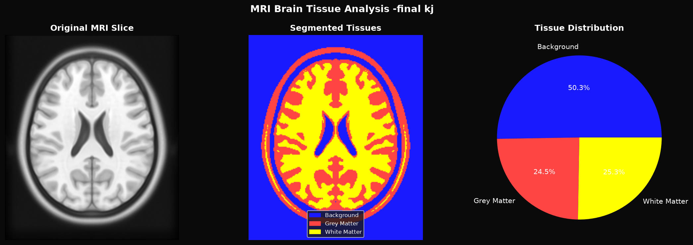

# MRI Brain Tissue Analysis & Report Generator

An automated MRI brain tissue analysis pipeline that segments brain tissue, measures clinical parameters, and generates a professional PDF report.



## What it does

This tool automatically:
- Loads a real MRI brain scan (ICBM152 standard template)
- Segments brain tissue into 3 regions using K-means clustering
- Measures each region with clinical parameters
- Generates a professional PDF report with charts and findings

## Clinical Measurements Generated

| Measurement | Description |
|---|---|
| Voxel Count | Number of pixels in each tissue region |
| Percentage | Proportion of total slice area |
| Avg Brightness | Mean signal intensity per tissue type |

## Tissue Classification

- 🔵 **Background** — area outside the brain
- 🔴 **Grey Matter** — outer brain tissue (thinking regions)
- 🟡 **White Matter** — inner brain connections

## Technologies Used

- **Python 3.13**
- **NiBabel** — MRI file handling
- **Scikit-learn** — K-means clustering
- **NumPy & Pandas** — numerical analysis and data organisation
- **Matplotlib** — visualisation and charts
- **ReportLab** — automated PDF report generation
- **Nilearn** — neuroimaging datasets

## Installation

```bash
git clone https://github.com/kuljit-medtech/mri-analysis.git
cd mri-analysis
python -m venv venv
.\venv\Scripts\Activate.ps1
pip install nibabel nilearn matplotlib numpy scipy scikit-learn reportlab pandas
```

## Usage

```bash
python analysis.py
```

Two files will be generated:
- `analysis_charts.png` — visualisation of results
- `MRI_Analysis_Report.pdf` — full clinical report

## Sample Report Contains

1. Introduction
2. Visualisation (original MRI + segmented + pie chart)
3. Tissue measurements table
4. Key findings
5. Methodology

## About

Developed by **Kuljit Singh** — MS student at Otto Von Guericke University, Magdeburg, Germany.

Part of a medical imaging portfolio focusing on MRI processing, quality assurance and AI-based analysis.

- 🔗 [GitHub](https://github.com/kuljit-medtech)
- 🔗 [LinkedIn](https://www.linkedin.com/in/kuljit-singh-021252197/)
- 🔗 [MRI Brain Viewer](https://github.com/kuljit-medtech/mri-brain-viewer)
- 🔗 [hazen Contribution](https://github.com/GSTT-CSC/hazen/pull/516)
- 🔗 [MRI Segmentation](https://github.com/kuljit-medtech/mri-segmentation)
